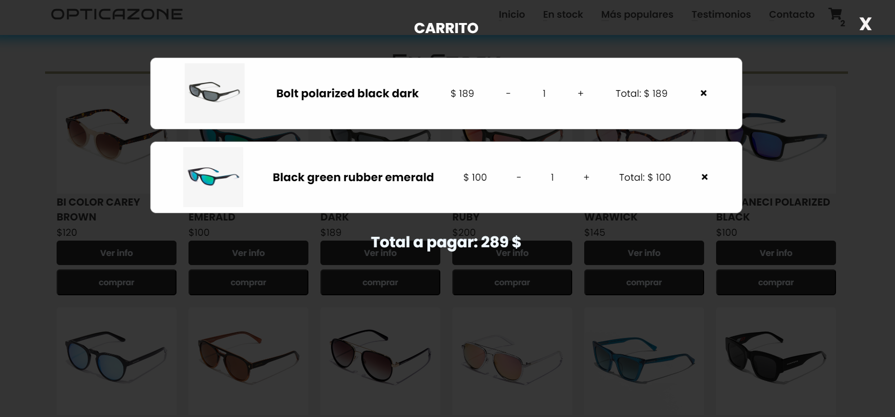

# OPTICA ZONE

## Descripción
Este proyecto web informativo sobre una optica, presenta una información breve y atractiva, contacto, sus productos, carro de compras, contacto, entre otra información.

## Contenido
- Información de la optica
- Catalago
- Testimonios
- Contacto

## Uso
Puedes visualizar el proyecto abriendo el archivo `index.html` en tu navegador web. Para editar la información, simplemente modifica los datos en el archivo correspondiente.

## Tecnologías Utilizadas
- HTML
- CSS
- JAVASCRIPT
- (FUNCIONES BACK END PARA EL FORMULARIO: PHP Y MYSQL, NO ESTAN INCLUIDAS EN ESTA VISTA)

## Capturas de Pantalla

¡Gracias por visitar OpticaZone!
